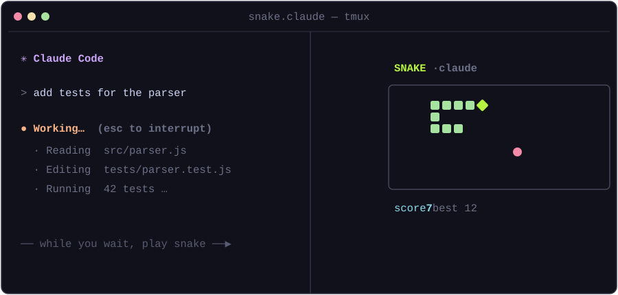

# snake.claude 🐍

Play **Snake** right next to Claude Code. The snake runs **while Claude is thinking**, and **pauses — keeping your score** — the moment Claude finishes and hands the keyboard back to you. A little something to do with those idle seconds.

<p align="center">
  
</p>

## Quick start

One command — no clone, no install (needs only Node.js):

```sh
npx snake.claude
```

That's it. The launcher:

1. Installs two tiny **hooks** into `~/.claude/settings.json` (backed up first).
2. Opens a **tmux split** — Claude Code on the left, Snake on the right.
3. Drops you in the Claude pane, ready to type.

Submit a prompt → the snake starts moving. When Claude finishes → it freezes with a *"your move"* overlay, score intact. Next prompt picks up right where you left off.

## Controls

| Key | Action |
| --- | --- |
| Arrow keys / `WASD` | Steer |
| `q` | Quit the game |
| `r` | Restart (after game over) |

## How it works

- **Per-session id** — each launch mints a unique `SNAKE_CLAUDE_ID`, passed to **both** panes. Claude's hooks run as child processes of the `claude` in the left pane, so they inherit it too.
- **Signal file** — `~/.claude/snake/<id>.state` holds a single word, `play` or `pause`. One file per session.
- **Hooks** — Claude Code's `UserPromptSubmit` hook writes `play`; the `Stop` hook writes `pause`, into *that session's* file. Fast shell one-liners, no processes spawned, guarded so a Claude session with no snake attached does nothing.
- **Game** — polls its own file each tick. Zero dependencies: raw ANSI + Node's TTY. It always restores your terminal cleanly, even on a crash, and removes its state file on quit.

The hooks carry a `# snake.claude` marker, so installing is idempotent and uninstalling is surgical.

### Multiple sessions

Run as many as you like — every launch gets its own id, tmux session, and state file, so two Claude+Snake pairs never touch each other's play/pause signal. Run `snake.claude game` on its own (no id) for standalone free-play.

## Uninstall

Removes only the snake.claude hooks; your other settings are untouched:

```sh
npx snake.claude uninstall
```

## Requirements

- **tmux** (Linux, macOS, or WSL) — provides the side-by-side split.
- **Node.js ≥ 16**.
- **Claude Code** on your `PATH` (the left pane runs `claude`).

> Native Windows (bare cmd/PowerShell) isn't supported — use **WSL**, where tmux runs fine.

## License

MIT
