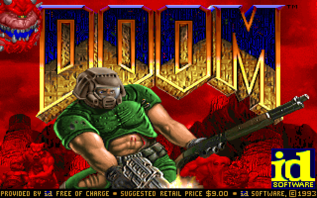

# doom.claude 😈

**The real DOOM, in your terminal, in one command.** No install, no WAD hunting, no compiler — `npx doom.claude` runs the actual DOOM engine (doomgeneric, compiled to WebAssembly) full-screen with truecolor half-block rendering. The shareware game data ships in the package.

<p align="center">
  
  <br>
  <em>Actual output from the bundled engine — rendered in your terminal as truecolor half-blocks.</em>
</p>

## Play

From a normal terminal (needs a real TTY — not Claude's `!`):

```sh
npx doom.claude
```

**Controls:** `WASD` / arrows move · `F` or `Ctrl` fire · `Space` use/open · `1`–`7` weapons · `Tab` map · `Esc` menu · `Q` quit.

> **Controls feel:** on terminals that support the **Kitty keyboard protocol** (Kitty, Ghostty, WezTerm) it auto-negotiates real key press/release events, so strafing and running are crisp. On other terminals it falls back to press-only with autorepeat (tap again to keep moving). Rendering uses **frame-diffing** (only changed cells are repainted), so it stays smooth even over SSH.

## Play it *next to* Claude

Want Doom running while you use Claude Code? A full-screen game can't share one terminal with Claude, so this opens a **tmux split** — Claude on the left, real Doom on the right:

```sh
npx doom.claude split
```

Focus the Doom pane (`Ctrl-b` then `→`) to play while you wait on a response; focus Claude to type. (Requires `tmux`; Linux/macOS/WSL.)

```
┌─ Claude ─────┐┌─ DOOM ───────┐
│ > working…   ││  ▓█ imp!      │
│              ││  HEALTH 80    │
└──────────────┘└──────────────┘
```

## How it works

- The engine is [**doomgeneric**](https://github.com/ozkl/doomgeneric) compiled to **WebAssembly** — it runs under plain Node, no native modules, no system packages. (The WASM build is vendored from [pi-doom](https://github.com/badlogic/pi-doom).)
- Each 640×400 frame is drawn with half-block `▀` characters: the top pixel is the cell's foreground color, the bottom pixel its background — two pixels per character cell, 24-bit color, fit to your terminal.
- Keyboard comes from raw-mode stdin, mapped to DOOM key codes.
- The **shareware WAD** (`doom1.wad`, "Knee-Deep in the Dead") is bundled — freely redistributable, unmodified.

## Requirements

- **Node.js ≥ 16** (WebAssembly support).
- A **truecolor terminal**. Linux, macOS, or WSL.

## Credits & license

- [id Software](https://github.com/id-Software/DOOM) — DOOM (© 1993).
- [doomgeneric](https://github.com/ozkl/doomgeneric) — the portable port.
- [pi-doom](https://github.com/badlogic/pi-doom) — the Node/WASM build this vendors.

**GPL-2.0-or-later** (see [LICENSE](LICENSE)). DOOM is a trademark of id Software; Claude and Claude Code are trademarks of Anthropic. This is an independent, unofficial tool, not affiliated with or endorsed by id Software or Anthropic.
