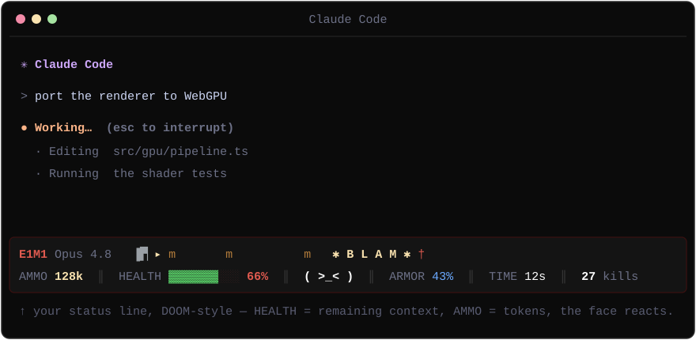

# doom.claude 😈

Your Claude Code status line, **DOOM-style**. The bottom of your terminal becomes the iconic DOOM HUD — **HEALTH = remaining context**, **AMMO = tokens**, and the **DOOMGUY face reacts to what Claude is doing** — with a little auto-firefight above it that heats up while Claude works. One command, no tmux, no extra window.

<p align="center">
  
</p>

## Quick start

One command — needs only Node.js. Works from a normal shell **or** via `!` right inside Claude:

```sh
npx doom.claude
```

It edits `~/.claude/settings.json` (backed up first) to add a status line + a few hooks, and drops two rows at the bottom of Claude that refresh about once a second:

```
E1M1 Opus 4.8   ▐▛▏ ▸ m      m        ✱ B L A M ✱ †        ← combat scene
AMMO 128k ║ HEALTH ▓▓▓▓▓▓▓░░ 66% ║ ( >_< ) ║ TIME 12s ║ 27 kills   ← DOOM status bar
```

If it doesn't appear immediately, reload settings with `/statusline` (or restart Claude Code).

## The mappings

| DOOM stat | What it really is |
| --- | --- |
| **HEALTH** | remaining context — as context fills, you *take damage* 🩸 |
| **AMMO** | total tokens |
| **ARMOR** | 5-hour usage budget remaining |
| **TIME** | elapsed on the current turn |
| **KILLS** | imps dropped in the firefight |
| **the DOOMGUY face** | reacts to Claude (see below) |
| **# of imps** | more active subagents → more imps storming the corridor |

**The face** says what Claude's up to:

| Face | Meaning |
| --- | --- |
| `( -.- )` | idle |
| `( >_< )` | thinking (generating) |
| `( ^o^ )` | just finished a turn |
| `( x_o )` | **hurt** — context nearly full |
| `( O_O )` | subagent swarm (3+ agents) |

## Why is it auto-play (I can't steer it)?

Because a status line **can't read your keyboard** — while Claude runs, your keys belong to Claude. The status line is display-only. So DOOM plays itself, and instead of controlling it you get a genuinely useful **activity + telemetry readout**. (This is also why there's no tmux or second window — none is needed.)

## Turning it off / on

A status line can't have a clickable close button (it can't receive input), so use:

```sh
npx doom.claude off     # remove the HUD + hooks (restores any status line you had before)
npx doom.claude on      # put it back
```

(`uninstall` / `install` are aliases.)

## Multiple Claude sessions

All state is keyed by `session_id`, so every open Claude session gets its **own** HUD and its **own** firefight — no cross-session interference.

## Check your status-line height (optional)

```sh
npx doom.claude probe     # shows numbered rows + the JSON fields available
npx doom.claude install   # switch back to the HUD
```

Count the numbered rows you can see — that's your height budget. (The HUD falls back to a single combined row if height is tight.)

## How it works

- **Status line** — `~/.claude/doom/statusline.js` runs each refresh (`refreshInterval: 1`). It reads the JSON context Claude pipes in, advances the firefight one tick, and prints two rows sized to your terminal width (read from `/dev/tty`). Per-session state, and written to **never crash** the status bar.
- **Hooks** — `UserPromptSubmit`/`Stop` flag busy/idle and stamp the turn's start/end; `SubagentStart`/`SubagentStop` keep an agent count. Each parses `session_id` from its own input. Tagged with a `# doom.claude` marker so install is idempotent and uninstall is surgical.

## Requirements

- **Node.js ≥ 16**.
- **Claude Code** (the status line + hooks are its features). Linux, macOS, or WSL.

## License

MIT
