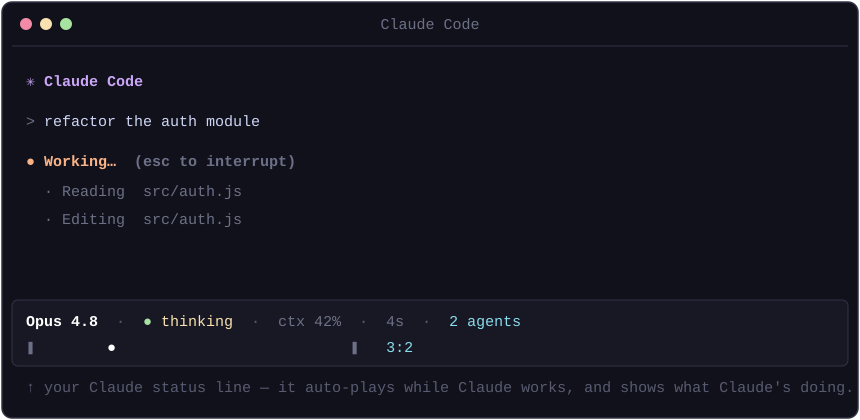

# snake.claude 🕹️

A tiny **arcade in your Claude Code status line**. It auto-plays **Pong** at the bottom of your terminal *and* doubles as a live readout of what Claude is doing — model, thinking/idle, context %, elapsed time, active agents. One command, no tmux, no extra window.

<p align="center">
  
</p>

## Quick start

One command — needs only Node.js. Works from a normal shell **or** via `!` right inside Claude:

```sh
npx snake.claude
```

That's it. It edits `~/.claude/settings.json` (backed up first) to add a status line + a few hooks, and drops two rows at the bottom of Claude that refresh about once a second:

```
Opus 4.8 · ● thinking · ctx 42% · 4s · 2 agents      ← live HUD
❚        ●                     ❚  3:2                 ← auto-play Pong
```

If it doesn't appear immediately, reload settings with `/statusline` (or restart Claude Code).

## Why is it auto-play (I can't steer it)?

Because a status line **can't read your keyboard** — while Claude is running, your keys belong to Claude. The status line is the only spot a command can draw live content in the Claude view, and it's display-only. So the game plays itself, and instead of *controlling* it you get a genuinely useful **activity readout** for free. (This is also why there's no tmux or second window — none is needed.)

## What the HUD shows

| Field | Meaning |
| --- | --- |
| `● thinking` / `○ idle` | whether Claude is currently generating (from hooks) |
| `Opus 4.8` | the active model |
| `ctx 42%` | context window used |
| `4s` | elapsed time on the current turn |
| `2 agents` | active subagents/tasks, when any are running |

## Check your status-line height (optional)

Status lines can render multiple rows, but the exact cap varies. To see yours:

```sh
npx snake.claude probe     # shows numbered rows + the JSON fields available
npx snake.claude install   # switch back to the game
```

Count the numbered rows you can see — that's your height budget.

## Turning it off / on

A status line can't have a clickable close button (it can't receive input), so use:

```sh
npx snake.claude off     # remove the status line + hooks (restores any you had before)
npx snake.claude on      # put it back
```

(`uninstall` / `install` are aliases.)

## Multiple Claude sessions

All state is keyed by `session_id`, so every open Claude session gets its **own** HUD (thinking/idle, timer, agents) and its **own** Pong — no cross-session interference.

## How it works

- **Status line** — `~/.claude/snake/statusline.js` runs each refresh (with `refreshInterval: 1`). It reads the JSON context Claude pipes in, advances Pong one tick, and prints two rows sized to your terminal width (read from `/dev/tty`). It **persists per-session game state** between runs and is written to **never crash** the status bar.
- **Hooks** — `UserPromptSubmit`/`Stop` flag busy/idle and stamp the turn's start time; `SubagentStart`/`SubagentStop` keep an agent count. Each parses `session_id` from its own input so state is per-session. Fast shell one-liners, tagged with a `# snake.claude` marker so install is idempotent (it also replaces stale entries from older versions) and uninstall is surgical.

## Requirements

- **Node.js ≥ 16**.
- **Claude Code** (the status line + hooks are its features). Linux, macOS, or WSL.

## Roadmap

- More mini-games (Snake, Space Invaders, aquarium, racer…) as a rotating roster.
- A taller dashboard layout where the status-line height allows.

## License

MIT
