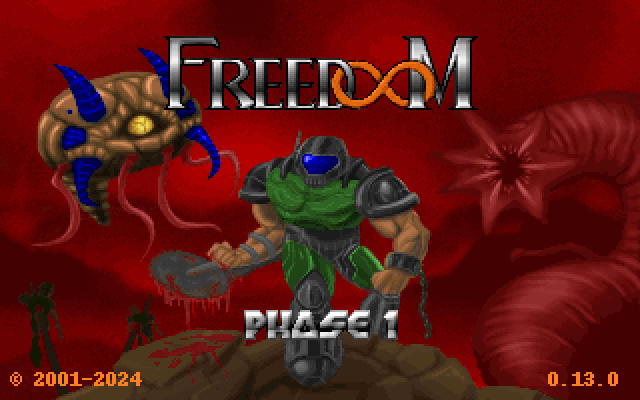

# kaboom.claude 😈

**Real [Freedoom](https://freedoom.github.io/), playable right next to Claude Code — in one command.** `npx kaboom.claude` opens a split: Claude on one side, the game on the other. The game **plays while Claude is thinking** and **pauses when it replies** — so you frag demons in the dead time and never miss Claude's answer. No install, no WAD hunting, no compiler; the real [doomgeneric](https://github.com/ozkl/doomgeneric) engine runs as WebAssembly with truecolor half-block rendering, and the free BSD-licensed game data ships in the package.

<p align="center">
  
  <br>
  <em>Actual output from the bundled engine (Freedoom Phase 1) — rendered in your terminal as truecolor half-blocks.</em>
</p>

## Play

From a normal terminal (needs `tmux`; Linux/macOS/WSL):

```sh
npx kaboom.claude
```

That's it — Claude and the game open side by side:

```
┌─ Claude ─────┐┌─ kaboom ─────┐
│ > working…   ││  ▓█ enemy!    │
│              ││  HEALTH 80    │
└──────────────┘└──────────────┘
```

Each pane is **labelled** (`◀ CLAUDE` / `GAME ▶`) and the **focused pane gets a bright green outline**, so it's always clear which one has your keys.

- **Auto-starts on Claude's turn:** the moment you send a prompt and Claude starts working, the game **jumps into focus and starts** — play the wait, hands-free.
- **You stay in control otherwise:** it plays while you're in its pane and quietly **waits when you switch to Claude**. It **never switches you back** to Claude on its own.
- **Claude at your own pace:** when the reply's ready, a **🔔 "ready" note** appears in the game (no interruption). Go read it whenever *you* like.
- **Switch:** **click** a pane, or the **◀ Claude** / **Game ▶** buttons in the bottom bar (or **Alt-←/→**). The green outline moves with you.
- **Zoom:** the **⤢ Zoom** button (or **Alt-z**) blows the game up to fullscreen for real playing; again to return.
- **Game keys:** `WASD` / arrows move · `F` or `Ctrl` fire · `Space` use · `1`–`7` weapons · `Q` quit.
- **Buttons:** `◀ Claude` · `Game ▶` · `⤢ Zoom` · `✕ Close game` (closes the game only — **Claude keeps running**; `Q` does the same). Runs on its own tmux socket, so your normal tmux config is untouched; remove the pause hooks with `npx kaboom.claude unhook`.

> **Rendering:** the picture is drawn with **quadrant blocks** (2×2 pixels per character cell) for legibility, and **frame-diffing** keeps it smooth even over SSH. It's still a terminal, so for the crispest view press **Alt-z** (or the **⤢ Zoom** button) to make the game fullscreen. On terminals with the **Kitty keyboard protocol** (Kitty, Ghostty, WezTerm) controls use real key press/release for crisp strafe/run; elsewhere they fall back to autorepeat.

### No tmux? Play full-screen

```sh
npx kaboom.claude play
```

Runs just the game, full-screen, on its own (no Claude split, no tmux).

## How it works

- The engine is [**doomgeneric**](https://github.com/ozkl/doomgeneric) compiled to **WebAssembly** — it runs under plain Node, no native modules, no system packages. (The WASM build is vendored from [pi-doom](https://github.com/badlogic/pi-doom).)
- Each 640×400 frame is drawn with half-block `▀` characters: the top pixel is the cell's foreground color, the bottom pixel its background — two pixels per character cell, 24-bit color, fit to your terminal.
- Keyboard comes from raw-mode stdin, mapped to Doom key codes.
- The game data is **[Freedoom](https://freedoom.github.io/) Phase 1** (`freedoom1.wad`) — a free, **BSD-3-Clause** IWAD with **no id Software assets**. Bundled, so there's nothing to fetch.

## Requirements

- **Node.js ≥ 16** (WebAssembly support).
- A **truecolor terminal**. Linux, macOS, or WSL.

## Credits & license

- [Freedoom](https://freedoom.github.io/) — the free BSD-licensed game data (`freedoom1.wad`). © 2001–2024 the Freedoom contributors (see `engine/FREEDOOM-CREDITS.txt`).
- [doomgeneric](https://github.com/ozkl/doomgeneric) — the portable Doom engine port (from id Software's GPL engine release).
- [pi-doom](https://github.com/badlogic/pi-doom) — the Node/WASM build this vendors.

**Code: GPL-2.0-or-later** (full text in [COPYING](COPYING)). **Game data (Freedoom): BSD-3-Clause.** See [LICENSE](LICENSE) for full attributions, the GPL corresponding-source offer, and modification notes. The bundled `engine/doom.js` + `engine/doom.wasm` are an unmodified WebAssembly build of [doomgeneric](https://github.com/ozkl/doomgeneric) (via pi-doom); complete corresponding source is at those upstream repos.

This project ships **no id Software assets**. DOOM is a trademark of id Software; Claude and Claude Code are trademarks of Anthropic. This is an independent, unofficial tool, not affiliated with or endorsed by id Software, the Freedoom project, or Anthropic.
