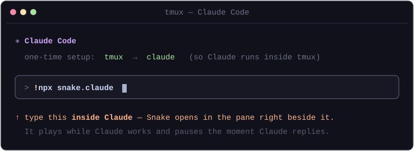

# snake.claude 🐍

Play **Snake** right next to Claude Code. The snake runs **while Claude is thinking**, and **pauses — keeping your score** — the moment Claude finishes and hands the keyboard back to you. A little something to do with those idle seconds.

<p align="center">
  
  <br>
  <em>After you run one command: Claude Code on the left, Snake in the pane beside it.</em>
</p>

## Quick start

Run Claude **inside tmux**, then launch snake from **inside Claude** with `!`. One-time setup:

```sh
tmux            # 1. start tmux
claude          # 2. start Claude Code inside it
```

Then type this **inside Claude** (the `!` prefix runs it in your shell):

```
!npx snake.claude
```

<p align="center">
  
</p>

Snake opens in a pane **right beside Claude**. Submit a prompt → the snake starts moving. When Claude replies → it freezes with a *"your move"* overlay, score intact. Next prompt picks up where you left off.

> **Why inside tmux?** While Claude Code owns your keyboard, the snake needs its own pane to read the arrow keys. tmux provides that pane; the `!` command splits Claude's current window so the game lands next to it. Focus the snake pane (`Ctrl-b` then `→`) to steer.

<details>
<summary><b>Don't want the <code>!</code> flow? Launch a fresh split instead.</b></summary>

From a **plain terminal** (not inside Claude), run:

```sh
npx snake.claude
```

It creates a fresh tmux session with Claude + Snake pre-split and drops you in. Same game, it just starts Claude for you.
</details>

## Controls

| Key | Action |
| --- | --- |
| Arrow keys / `WASD` | Steer |
| `q` | Quit the game |
| `r` | Restart (after game over) |

## How it works

- **Window-keyed signal** — Claude and its snake share one tmux **window**, so the state file is keyed by that window's id: `~/.claude/snake/@N.state` holds a single word, `play` or `pause`. Nothing is injected into Claude's environment — both sides derive the same id from tmux.
- **Hooks** — Claude Code's `UserPromptSubmit` hook writes `play`; the `Stop` hook writes `pause`, into the current window's file. Fast shell one-liners, no processes spawned, and guarded on `$TMUX` so a Claude session outside tmux (no snake attached) does nothing.
- **Game** — polls its window's file each tick. Zero dependencies: raw ANSI + Node's TTY. It always restores your terminal cleanly, even on a crash, and removes its state file on quit.

The hooks carry a `# snake.claude` marker, so installing is idempotent and uninstalling is surgical.

### Multiple sessions

Open snake in as many Claude windows as you like — each window has its own id and state file, so two Claude+Snake pairs never touch each other's play/pause signal. Run `snake.claude game` on its own (outside tmux) for standalone free-play.

## Uninstall

Removes only the snake.claude hooks; your other settings are untouched:

```sh
npx snake.claude uninstall
```

## Requirements

- **tmux** (Linux, macOS, or WSL) — provides the side-by-side split.
- **Node.js ≥ 16**.
- **Claude Code** on your `PATH` (the left pane runs `claude`).

> Native Windows (bare cmd/PowerShell) isn't supported — use **WSL**, where tmux runs fine.

## License

MIT
